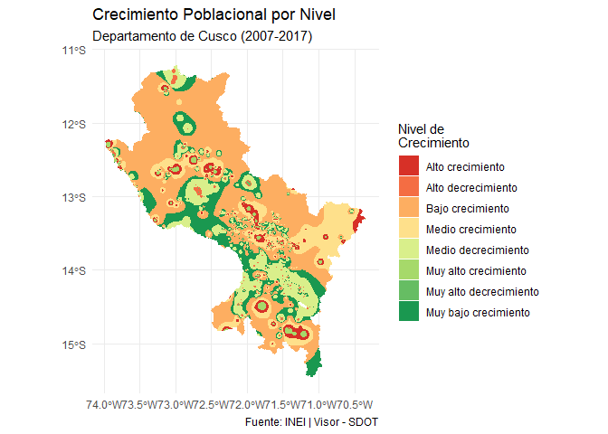

<!-- README.md is generated from README.Rmd. Please edit that file -->

# rsdot

<!-- badges: start -->

[](https://lifecycle.r-lib.org/articles/stages.html#experimental)
[](https://CRAN.R-project.org/package=rsdot)
[](https://github.com/PaulESantos/rsdot/actions/workflows/R-CMD-check.yaml)
[](https://app.codecov.io/gh/PaulESantos/rsdot)
<!-- badges: end -->

`rsdot` proporciona acceso programático a la información geográfica
producida y recopilada por la Secretaría de Demarcación y Organización
Territorial (SDOT) de la Presidencia del Consejo de Ministros (PCM) del
Perú.

El paquete facilita el acceso y manipulación de diversas capas
vectoriales, incluyendo:

- Límites censales INEI 2023

- Provincias, distritos y departamentos

- Información del modelo geográfico SDOT

- Infraestructura, centros poblados, riesgos y peligros

- Otras capas temáticas territoriales

### ⚠️ Importante:

Los límites censales del INEI provistos por este paquete son
referenciales y no constituyen límites oficiales ni tienen efecto legal
demarcatorio.

### ✨ Características

Acceso programático a datos espaciales del Perú.

Descarga automática desde OSF con caché inteligente.

Corrección robusta de caracteres especiales (Ñ, tildes).

Compatible con sf, ggplot2, dplyr y herramientas SIG modernas.

Funciones principales:

get_departamentos()

get_provincias()

get_distritos()

### 📦 Instalación

Instalar la versión de desarrollo desde GitHub:

``` r
install.packages("remotes")
remotes::install_github("PaulESantos/rsdot")
# or
install.packages("pak")
pak::pak("PaulESantos/rsdot")
```

### 🚀 Ejemplos

Cargar el paquete

``` r
library(rsdot)
library(sf)
#> Linking to GEOS 3.13.1, GDAL 3.10.2, PROJ 9.5.1; sf_use_s2() is TRUE
```

Obtener departamentos

``` r
deps <- get_departamentos()
#> Descargando: Límites Censales Departamentales (INEI 2023)...
#> Fuente: OSF - Repositorio DEMARCA
#> ✓ Descarga completada
#> Descomprimiendo archivos...
#> Cargando geometrías...
#> ✓ Datos cargados: 25 departamentos
deps
#> Simple feature collection with 25 features and 7 fields
#> Geometry type: MULTIPOLYGON
#> Dimension:     XY
#> Bounding box:  xmin: -81.32823 ymin: -18.35093 xmax: -68.65228 ymax: -0.03860597
#> Geodetic CRS:  WGS 84
#> # A tibble: 25 × 8
#>      gid iddpto nombdep      capital      tipo_norma numero fecha     
#>    <int> <chr>  <chr>        <chr>        <chr>      <chr>  <date>    
#>  1     1 01     AMAZONAS     CHACHAPOYAS  LEY        S/N    1832-11-21
#>  2     2 02     ANCASH       HUARAZ       LEY        S/N    1851-11-05
#>  3     3 03     APURIMAC     ABANCAY      LEY        S/N    1873-04-28
#>  4     4 04     AREQUIPA     AREQUIPA     REGLAMENTO S/N    1822-04-26
#>  5     5 05     AYACUCHO     AYACUCHO     REGLAMENTO S/N    1822-04-26
#>  6     6 06     CAJAMARCA    CAJAMARCA    LEY        S/N    1857-01-02
#>  7     7 07     CALLAO       CALLAO       <NA>       <NA>   NA        
#>  8     8 08     CUSCO        CUSCO        REGLAMENTO S/N    1822-04-26
#>  9     9 09     HUANCAVELICA HUANCAVELICA LEY        S/N    1857-01-02
#> 10    10 10     HUANUCO      HUANUCO      LEY        S/N    1869-01-24
#> # ℹ 15 more rows
#> # ℹ 1 more variable: geometry <MULTIPOLYGON [°]>
```

Visualización básica

``` r
library(ggplot2)

ggplot(deps) +
geom_sf(fill = "steelblue", color = "white") +
theme_minimal() +
labs(
title = "Departamentos del Perú",
caption = "Fuente: SDOT - PCM / INEI 2023"
)
```


Obtener provincias de un departamento

``` r
cusco_prov <- get_provincias(departamento = "CUSCO")
#> Descargando: Límites Censales Provinciales (INEI 2023)...
#> Fuente: OSF - Repositorio DEMARCA
#> ✓ Descarga completada
#> Descomprimiendo archivos...
#> Cargando geometrías...
#> ✓ Filtrado por departamento: 13 provincia(s) en CUSCO
#> ✓ Datos cargados: 13 provincia(s)
head(cusco_prov)
#> Simple feature collection with 6 features and 9 fields
#> Geometry type: MULTIPOLYGON
#> Dimension:     XY
#> Bounding box:  xmin: -72.77286 ymin: -14.88788 xmax: -70.78982 ymax: -12.50659
#> Geodetic CRS:  WGS 84
#> # A tibble: 6 × 10
#>     gid iddpto nombdep idprov nombprov     capital  tipo_norma numero fecha     
#>   <int> <chr>  <chr>   <chr>  <chr>        <chr>    <chr>      <chr>  <date>    
#> 1     3 08     CUSCO   0802   ACOMAYO      ACOMAYO  Ley        S/N    1861-02-23
#> 2     9 08     CUSCO   0803   ANTA         ANTA     Ley        S/N    1839-11-19
#> 3    28 08     CUSCO   0804   CALCA        CALCA    Reglament… S/N    1825-06-21
#> 4    31 08     CUSCO   0805   CANAS        YANAOCA  Ley        S/N    1833-10-14
#> 5    32 08     CUSCO   0806   CANCHIS      SICUANI  Ley        S/N    1833-10-14
#> 6    54 08     CUSCO   0807   CHUMBIVILCAS SANTO T… Reglament… S/N    1825-06-21
#> # ℹ 1 more variable: geometry <MULTIPOLYGON [°]>

#Mapa de provincias

ggplot(cusco_prov) +
geom_sf(aes(fill = nombprov), color = "white", linewidth = 0.3) +
scale_fill_viridis_d(option = "plasma") +
theme_minimal() +
labs(
title = "Provincias del Departamento de Cusco",
subtitle = "INEI 2023 | Referencial",
fill = "Provincia"
)
```


Obtener distritos Ejemplo: Cañete (Lima)

``` r

canete <- get_distritos(
provincia = "CAÑETE",
departamento = "LIMA"
)
#> Descargando: Límites Censales Distritales (INEI 2023)...
#> Fuente: OSF - Repositorio DEMARCA
#> Nota: Este es un archivo grande, puede tardar varios minutos...
#> ✓ Descarga completada
#> Descomprimiendo archivos...
#> Cargando geometrías distritales...
#> ✓ Filtrado por departamento: 171 distrito(s) en LIMA
#> ✓ Filtrado por provincia: 16 distrito(s) en CAÑETE
#> ✓ Filtrado completado por departamento > provincia: 16 distrito(s)
canete
#> Simple feature collection with 16 features and 11 fields
#> Geometry type: MULTIPOLYGON
#> Dimension:     XY
#> Bounding box:  xmin: -76.79125 ymin: -13.32351 xmax: -75.94078 ymax: -12.27573
#> Geodetic CRS:  WGS 84
#> # A tibble: 16 × 12
#>      gid ubigeo nombdep nombprov nombdist   capital region_nat tipo_norma numero
#>    <int> <chr>  <chr>   <chr>    <chr>      <chr>   <chr>      <chr>      <chr> 
#>  1   825 150501 LIMA    CAÑETE   SAN VICEN… SAN VI… COSTA      Ley        S/N   
#>  2   826 150502 LIMA    CAÑETE   ASIA       ASIA    COSTA      Ley        15112 
#>  3   827 150505 LIMA    CAÑETE   CHILCA     CHILCA  COSTA      Ley        S/N   
#>  4   828 150507 LIMA    CAÑETE   IMPERIAL   IMPERI… COSTA      Ley        1170  
#>  5   829 150509 LIMA    CAÑETE   MALA       MALA    COSTA      Ley        S/N   
#>  6   830 150512 LIMA    CAÑETE   QUILMANA   QUILMA… COSTA      Ley        9962  
#>  7   831 150515 LIMA    CAÑETE   SANTA CRU… SANTA … COSTA      Ley        4611  
#>  8   895 150503 LIMA    CAÑETE   CALANGO    CALANGO COSTA      Ley        S/N   
#>  9   896 150504 LIMA    CAÑETE   CERRO AZUL CERRO … COSTA      Ley Regio… 464   
#> 10   897 150506 LIMA    CAÑETE   COAYLLO    COAYLLO COSTA      Ley        S/N   
#> 11   898 150508 LIMA    CAÑETE   LUNAHUANA  LUNAHU… COSTA      Ley        S/N   
#> 12   899 150510 LIMA    CAÑETE   NUEVO IMP… NUEVO … COSTA      Ley        14154 
#> 13   900 150511 LIMA    CAÑETE   PACARAN    PACARAN COSTA      Ley        S/N   
#> 14   901 150513 LIMA    CAÑETE   SAN ANTON… SAN AN… COSTA      Ley        4611  
#> 15   902 150514 LIMA    CAÑETE   SAN LUIS   SAN LU… COSTA      Ley        S/N   
#> 16   903 150516 LIMA    CAÑETE   ZUÑIGA     ZUÑIGA  COSTA      Ley        9674  
#> # ℹ 3 more variables: fecha_fin <date>, comentario <chr>,
#> #   geometry <MULTIPOLYGON [°]>

#Visualización

ggplot(canete) +
geom_sf(aes(fill = nombdist), color = "white", linewidth = 0.3) +
theme_minimal() +
labs(
title = "Distritos de la Provincia de Cañete",
subtitle = "Referencia Censal INEI 2023",
fill = "Distrito"
)
```



### 🤝 Contribuciones

Las contribuciones son bienvenidas.

Por favor abre un issue o pull request:

> 👉 <https://github.com/PaulESantos/rsdot/issues>

### 📄 Licencia

Este paquete utiliza la licencia MIT. Consulta LICENSE para más
detalles.

### 👤 Autor

Paul Efren Santos Andrade ORCID: 0000-0002-6635-0375
<a href="mailto:paulefrens@gmail.com"
class="uri">mailto:paulefrens@gmail.com</a>

### 🌐 Sitio web del paquete

Documentación ampliada: \> 👉 <https://paulesantos.github.io/rsdot/>
